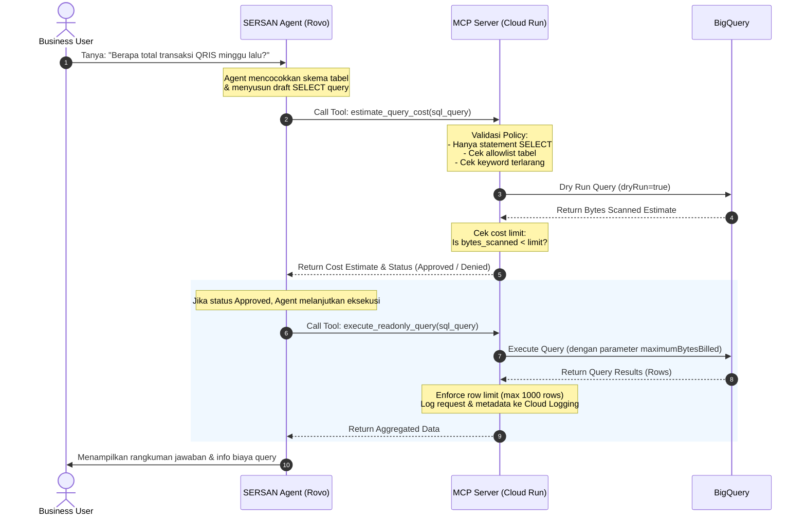
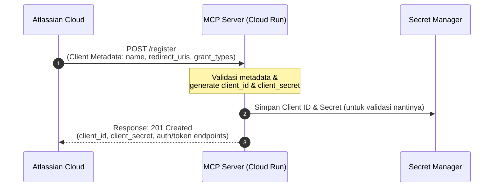
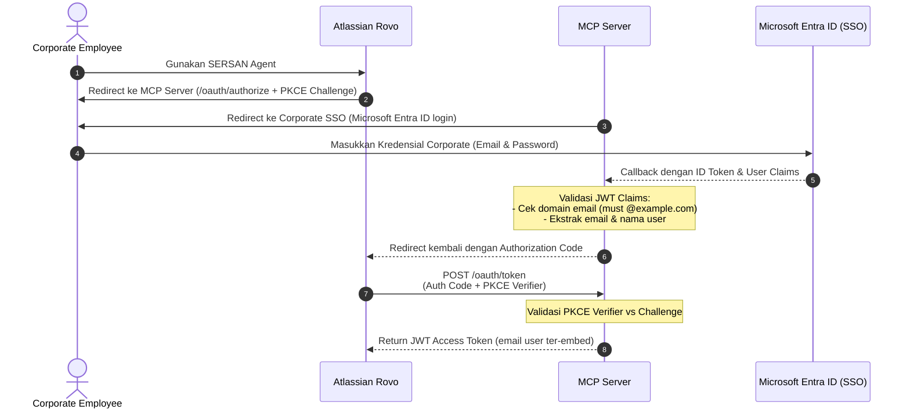

# Detail Arsitektur Opsi 2 — Self-hosted BigQuery MCP Server untuk SERSAN Agent

Dokumen ini merinci rancangan teknis untuk **Opsi 2**: **self-hosted BigQuery MCP Server** yang dideploy ke Cloud Run agar SERSAN Agent dapat mengeksekusi query BigQuery secara aman, terukur, dan dapat diaudit.

**Tujuan keputusan**
Menentukan seperti apa desain target Opsi 2 yang cukup aman untuk pilot, tetap ringan untuk dibangun, dan memberi ruang evolusi ke model audit serta identity yang lebih matang.

## Ringkasan rancangan

Opsi 2 menempatkan satu layer kontrol milik Corporate di antara Rovo Agent dan BigQuery. Layer ini berfungsi sebagai **MCP Server**, sekaligus policy enforcement point untuk validasi query, pembatasan dataset, estimasi biaya, audit logging, dan kontrol output. Dibanding opsi managed, pendekatan ini memberi kontrol yang lebih kuat atas guardrail dan observability, dengan trade-off berupa effort build dan maintenance.

Untuk fase awal, rancangan yang paling realistis adalah memakai **shared service account + custom audit enrichment**. Artinya query tetap dijalankan oleh satu service account khusus SERSAN, tetapi setiap request dicatat dengan identitas user dari layer Rovo jika tersedia. Model ini lebih sederhana daripada impersonation, namun sudah cukup untuk pilot terbatas.

## Konteks dan sasaran desain

Dokumen solutioning sebelumnya merekomendasikan memulai dari Opsi 1 untuk validasi tercepat, lalu beralih ke Opsi 2 jika dibutuhkan custom guardrail, audit yang lebih kaya, atau jika integrasi auth pada endpoint Google managed tidak feasible. Draft ini mengasumsikan Opsi 2 dibutuhkan karena salah satu dari tiga alasan berikut:

* Rovo Admin Hub tidak dapat terhubung langsung ke endpoint Google managed dengan auth yang kompatibel.
* Guardrail bawaan belum cukup, terutama untuk `max_bytes_billed`, allowlist dataset, dan logging per user.
* Dibutuhkan error handling dan UX yang lebih sesuai untuk user business Corporate.

Sasaran desain fase awal adalah:

* Hanya mendukung **read-only analytics**.
* Hanya membuka **dataset yang sudah di-allowlist**.
* Mewajibkan **estimasi cost** sebelum eksekusi.
* Mengutamakan **hasil agregat**, bukan raw data customer.
* Menyediakan **audit trail** yang cukup untuk monitoring dan investigasi.

## Arsitektur target

Alur utama yang diusulkan:

1. User mengirim pertanyaan ke SERSAN Agent di Rovo.
2. SERSAN memutuskan perlu memanggil tool MCP.
3. Rovo memanggil endpoint MCP Server Corporate yang dihosting di Cloud Run.
4. MCP Server memvalidasi tool request, user context, query intent, dan policy.
5. MCP Server menjalankan dry run ke BigQuery untuk estimasi bytes scanned.
6. Jika lolos policy, MCP Server mengeksekusi query readonly ke BigQuery.
7. Hasil dikembalikan ke SERSAN dalam bentuk terbatas dan aman.
8. Log request, SQL, estimate, result metadata, dan outcome disimpan ke audit sink.

### Diagram Arsitektur & Alur Data

#### 1. Diagram Arsitektur Jaringan & Komponen
Diagram berikut menggambarkan batas jaringan (network boundary), protokol, serta keterkaitan antar komponen GCP dan Atlassian Cloud.

```mermaid
graph TD
    subgraph Atlassian Cloud
        Rovo[SERSAN Agent in Rovo]
    end

    subgraph Internet
        HTTPS[HTTPS Traffic / Protected by OAuth 2.1]
    end

    subgraph Google Cloud Platform (GCP)
        subgraph Cloud Run
            MCPServer[Custom MCP Server<br>Node.js or Python]
        end
        
        subgraph Security & Config
            SecretMgr[Secret Manager<br>OAuth Clients / Config]
            CloudLogging[Cloud Logging<br>Structured Request Logs]
        end

        subgraph BigQuery Data Warehouse
            BQEngine[BigQuery Query Engine]
            subgraph Datasets
                AllowlistDB[Allowlisted Datasets<br>Read-Only Access]
                AuditTable[Audit Log Table]
                RestrictedDB[Restricted Datasets<br>Blocked by IAM]
            end
        end
    end

    Rovo -->|1. Tool Call| HTTPS
    HTTPS -->|2. Ingress Route| MCPServer
    MCPServer -.->|Read Auth Config| SecretMgr
    MCPServer -->|3. Dry Run / Execute| BQEngine
    BQEngine -->|4. Query Data| AllowlistDB
    BQEngine -.->|Access Denied| RestrictedDB
    MCPServer -.->|5. Write Logs| CloudLogging
    CloudLogging -.->|Log Sink| AuditTable
    MCPServer -->|6. Return Aggregated Data| Rovo
```

#### 2. Sequence Diagram (Alur Interaksi Query)
Diagram ini menjelaskan interaksi sekuensial dua tahap (estimate -> execute) antara Rovo Agent, Custom MCP Server, dan BigQuery.



### Komponen

| Komponen | Peran | Catatan desain |
| --- | --- | --- |
| SERSAN Agent di Rovo | Antarmuka user dan reasoning layer | Menyusun intent, klarifikasi, dan memanggil tool MCP sesuai instruction. |
| External MCP Server di Cloud Run | Policy enforcement dan tool execution layer | Komponen inti Opsi 2; memegang validasi query, audit, dan integrasi BigQuery. |
| BigQuery | Execution engine dan metadata source | Hanya readonly; akses dibatasi pada dataset yang diizinkan. |
| Cloud Logging / BigQuery Audit Table | Observability dan audit trail | Menyimpan event per request, termasuk estimate dan execution outcome. |

## Forecasting Cost

### Komponen Biaya

| Komponen | Satuan Harga | Keterangan |
| --- | --- | --- |
| **Cloud Run — CPU** | $0.000024 / vCPU-second | Free tier: 180k vCPU-sec/bulan |
| **Cloud Run — Memory** | $0.0000025 / GiB-second | Free tier: 360k GiB-sec/bulan |
| **Cloud Run — Request** | $0.40 / juta request | Free tier: 2 juta request/bulan |
| **BigQuery — On-demand** | $6.25 / TB data scanned | Free tier: 1 TB/bulan |
| **Secret Manager** | $0.06 / 10k access | Untuk credential service account |
| **Cloud Logging** | $0.50 / GiB setelah 50 GiB free | Audit log custom |

### Asumsi Dasar

| Parameter | Nilai |
| --- | --- |
| Cloud Run allocation | 1 vCPU, 512 MiB memory |
| Rata-rata durasi per request | ~3 detik, termasuk BigQuery execution |
| Rata-rata data scan per query | ~200 MB, asumsi query agregat, partitioned, dan filtered |
| Minimum instance | 0, scale-to-zero, tanpa always-on |
| Query type | Read-only aggregation, seperti COUNT, SUM, AVG, GROUP BY |
| Dataset | Partitioned by date dan clustered |

### Skenario Biaya Bulanan

* **Skenario 1 — PoC (3-5 user, ~1.000 query/bulan)**

| Komponen | Perhitungan | Biaya |
| --- | --- | --- |
| Cloud Run | 3.000 vCPU-sec + 1.500 GiB-sec + 1k request → semua di bawah free tier | ~$0 |
| BigQuery | 1.000 × 200 MB = 200 GB → di bawah 1 TB free tier | ~$0 |
| Supporting services | Secret Manager + Logging minimal | ~$1 |
| **Total PoC** | | **~$1/bulan** |

* **Skenario 2 — Pilot (10-20 user, ~5.000 query/bulan)**

| Komponen | Perhitungan | Biaya |
| --- | --- | --- |
| Cloud Run | 15.000 vCPU-sec + 7.500 GiB-sec + 5k request → masih di bawah free tier | ~$0 |
| BigQuery | 5.000 × 200 MB = 1 TB → mendekati batas free tier | ~$0 – $3 |
| Supporting services | Secret Manager + Logging | ~$3 – $5 |
| **Total Pilot** | | **~$3 – $8/bulan** |

* **Skenario 3 — Production (50-100 user, ~15.000 query/bulan)**

| Komponen | Perhitungan | Biaya |
| --- | --- | --- |
| Cloud Run (scale-to-zero) | 45.000 vCPU-sec → masih di bawah free tier | ~$0 |
| Cloud Run (min 1 instance, untuk avoid cold start) | ~2.6M vCPU-sec billed + memory | ~$65 – $70 |
| BigQuery | 15.000 × 200 MB = 3 TB → 2 TB charged × $6.25 | ~$12.50 |
| BigQuery, jika rata-rata scan lebih besar ~500 MB | 7.5 TB → 6.5 TB × $6.25 | ~$40.63 |
| Supporting services | Logging + Secret Manager + monitoring | ~$10 – $15 |
| **Total Production (scale-to-zero)** | | **~$23 – $56/bulan** |
| **Total Production (min 1 instance)** | | **~$88 – $126/bulan** |

### Skenario Worst Case — Tanpa Guardrail

| Kondisi | Perhitungan | Biaya |
| --- | --- | --- |
| Full table scan tanpa partition filter, rata-rata 5 GB/query | 15.000 × 5 GB = 75 TB → 74 TB × $6.25 | **~$463/bulan** |
| **Dengan guardrail** `max_bytes_billed = 1 GB` | Capped: 15 TB max → 14 TB × $6.25 | **~$88/bulan** |

### Ringkasan & Insight

| Aspek | Insight |
| --- | --- |
| **PoC sangat murah** | Pada volume PoC ≤1000 query, hampir semua biaya ditanggung free tier. Cost efektif sekitar $0-1/bulan. |
| **BigQuery dominan** | Di semua skenario, biaya BigQuery query scan jauh lebih besar dari biaya Cloud Run compute. Optimasi utama ada di sisi query efficiency: partition filter dan column selection. |
| **Cold start vs cost** | Tanpa minimum instance: gratis tetapi cold start sekitar 2-5 detik. Dengan min 1 instance: sekitar $65-70/bulan tetapi response time konsisten. Rekomendasi: mulai tanpa min instance untuk PoC/Pilot. |
| **Guardrail `max_bytes_billed` krusial** | Satu parameter ini bisa membatasi worst case dari ~$463 menjadi ~$88/bulan. Wajib diterapkan sejak awal. |
| **Biaya development (one-time)** | Estimasi effort: ~2-3 minggu engineer untuk build, deploy, test, dan hardening. Bukan biaya cloud, tetapi perlu diperhitungkan sebagai investment. |

* **Perbandingan Cost: Opsi 1 vs Opsi 2**

| Aspek | Opsi 1 (Google Managed) | Opsi 2 (Self-hosted Cloud Run) |
| --- | --- | --- |
| Infra cost | $0, no server | $0 – $70/bulan, tergantung minimum instance |
| BigQuery cost | Sama — on-demand $6.25/TB | Sama — on-demand $6.25/TB |
| Cost control | Terbatas, IAM + built-in limit | Penuh: `max_bytes_billed` dan custom cap per user |
| Worst case protection | Lemah, tidak ada hard cap per query | Kuat, hard cap per query + per user |
| Development cost | ~hari | ~2-3 minggu |
| Ongoing maintenance | $0 | ~2-4 jam/bulan untuk monitoring dan patching |

## Keputusan desain yang direkomendasikan

* Deploy MCP Server sebagai service di Cloud Run dengan scale-to-zero untuk fase PoC/pilot.
* Gunakan shared service account khusus SERSAN untuk eksekusi query pada fase awal.
* Tambahkan custom audit enrichment di layer MCP Server agar setiap request dapat dikaitkan ke user peminta.
* Batasi tool execution ke query SELECT saja, dengan dry run wajib dan `max_bytes_billed` enforced.

## Desain komponen aplikasi

### 1. MCP transport layer

Sesuai dengan [syarat integrasi Atlassian](https://support.atlassian.com/organization-administration/docs/add-an-external-mcp-server-from-atlassian-administration/), server harus mengekspos endpoint MCP berbasis **Streamable HTTP transport** yang kompatibel dengan integrasi external MCP di Rovo. 
* **Transport Requirement**: Atlassian Cloud **TIDAK MENDUKUNG** SSE-only (Server-Sent Events saja) atau `stdio` (standard input/output). Server harus mengimplementasikan Streamable HTTP transport (menggunakan request/response HTTP standard via POST).
* **Network & Ingress**: Karena runtime Rovo berada di cloud Atlassian, endpoint harus dapat diakses secara publik menggunakan HTTPS dengan sertifikat TLS yang valid (disediakan secara native oleh Cloud Run).

### 2. Tool handler layer

Layer ini memetakan interface tool MCP (JSON schema yang dibaca oleh Rovo Agent) ke fungsi internal server. Dibandingkan langsung mengekspos low-level tools bawaan Google MCP Toolbox (seperti `bigquery-execute-sql` atau `bigquery-list-dataset-ids` yang terlalu bebas), rancangan ini merekomendasikan **kontrak tool kustom** untuk membatasi ruang gerak Agent secara eksplisit dan aman.

Pemisahan tools di bawah ini didesain agar Agent mengikuti alur interaksi yang sehat: **Metadata ➔ Estimate ➔ Execute**.

*   `list_allowed_tables`
    *   **Deskripsi**: Mengembalikan daftar nama tabel, dataset, beserta deskripsi singkatnya yang telah masuk ke dalam allowlist SERSAN.
    *   **Perilaku Teknis**: Mengisolasi Agent agar tidak dapat melihat atau menebak skema tabel sensitif di luar ruang lingkup pilot.
    *   **Under the hood**: Membaca konfigurasi allowlist statis dari Secret Manager atau environment variables.
*   `describe_table`
    *   **Deskripsi**: Menerima nama tabel, lalu mengembalikan skema detail (nama kolom, tipe data, deskripsi kolom, dan flag sensitivitas data).
    *   **Perilaku Teknis**: Membantu Agent menyusun sintaks SQL `SELECT` yang akurat dan terhindar dari pemanggilan kolom sensitif (seperti data pribadi/raw PI).
    *   **Under the hood**: Menjalankan query metadata ke `INFORMATION_SCHEMA.COLUMNS` di BigQuery dengan hak akses read-only.
*   `estimate_query_cost`
    *   **Deskripsi**: Menerima draft SQL query dari Agent, memvalidasinya di Policy Engine, lalu menjalankan dry-run untuk menghitung volume data yang akan dipindai (*bytes scanned*).
    *   **Perilaku Teknis**: Mengembalikan hasil estimasi bytes scanned, perkiraan biaya (GCP billing), serta status kelayakan query (Approved / Rejected jika melampaui `max_bytes_billed`).
    *   **Under the hood**: Memanggil API BigQuery dengan opsi `dryRun = true`. Hasil dry run tidak memakan biaya GCP sama sekali.
*   `execute_readonly_query`
    *   **Deskripsi**: Menerima SQL query final dan mengeksekusinya ke BigQuery untuk mengambil data hasil query.
    *   **Perilaku Teknis**: Memotong baris data (*row capping*) maksimal 1000 baris untuk mencegah pengiriman payload berlebih ke Atlassian Rovo. Hanya memperbolehkan query yang telah melewati estimasi.
    *   **Under the hood**: Mengirimkan query job ke BigQuery dengan parameter `maximumBytesBilled` terkonfigurasi keras (hard-coded) di level aplikasi sebagai *fail-safe* terakhir.

> [!TIP]
> **Pemisahan Logika:** Pemisahan ini mencegah Agent bertindak impulsif. Jika Agent langsung memanggil `execute_readonly_query` tanpa `estimate_query_cost` terlebih dahulu, sistem MCP Server dapat memprogram penolakan otomatis (reject) untuk memaksa Agent melakukan estimasi cost kepada user terlebih dahulu.

Jika tim memutuskan menggunakan basis **Google MCP Toolbox (mcp-toolbox)**, tools kustom di atas dapat dibuat sebagai *custom endpoints/middleware* yang membungkus SDK Google secara internal (Hybrid Approach).

### 3. Policy engine

Semua request query harus melewati pemeriksaan berikut sebelum dieksekusi:

* Hanya statement `SELECT`.
* Blok keyword seperti `INSERT`, `UPDATE`, `DELETE`, `MERGE`, `CREATE`, `DROP`, `ALTER`, scripting, dan multi-statement.
* Dataset dan tabel harus masuk allowlist.
* Kolom sensitif harus diblok via kombinasi column-level security dan denylist tambahan.
* Harus lolos dry run.
* Bytes scanned harus di bawah batas yang ditetapkan.
* Row limit output harus dipotong ke batas aman.

> [!NOTE]  
> Validasi query tidak boleh hanya berbasis pencarian keyword sederhana. Minimal perlu parser atau normalisasi query yang cukup untuk mendeteksi multi-statement, comment abuse, dan query rewriting yang mencoba melewati blokir dasar.

### 4. BigQuery execution layer

Layer ini menggunakan service account khusus, misalnya `sersan-agent@...`, dengan permission seminimal mungkin. Untuk fase awal, kombinasi permission yang diinginkan adalah **job execution** dan **read access** hanya pada dataset allowlist. Hindari grant level project yang terlalu luas jika akses dataset-level sudah cukup.

Setiap eksekusi query sebaiknya menambahkan kontrol berikut:

* `dryRun = true` untuk estimate lebih dulu.
* `maximumBytesBilled` untuk hard cap biaya.
* `timeoutMs` di level aplikasi.
* `labels` untuk menandai job, misalnya `source=sersan_mcp`, `env=pilot`, dan user hash jika dibutuhkan.

### 5. Audit and observability layer

Audit minimum per request:

* timestamp request
* request id
* user identifier dari Rovo context jika tersedia
* tool name
* prompt ringkas atau prompt hash
* generated SQL
* dry run bytes estimate
* dataset/table yang disentuh
* execution status
* error code atau denial reason
* returned row count

Untuk fase awal, log dapat dikirim ke Cloud Logging dan disinkronkan ke BigQuery audit table agar mudah dianalisis berkala.

## Opsi implementasi teknis

| Opsi | Deskripsi | Kelebihan | Kekurangan |
| --- | --- | --- | --- |
| Adopsi MCP Toolbox Google | Menggunakan basis open-source Google lalu menambah wrapper/policy layer | Mempercepat build, fondasi MCP sudah tersedia | Tetap perlu customisasi untuk policy, audit, dan UX error |
| Build custom server ringan | Membangun MCP Server sendiri khusus untuk use case SERSAN | Kontrol penuh atas tool, policy, dan response format | Effort engineering lebih tinggi dan testing lebih banyak |
| Hybrid | Gunakan toolbox untuk koneksi dasar, tambah middleware validasi internal | Balance antara speed dan control | Arsitektur sedikit lebih kompleks |
| Proxy ke Managed MCP | Cloud Run bertindak sebagai reverse proxy ke Google Managed MCP (`https://bigquery.googleapis.com/mcp`) | Tidak perlu menulis kode integrasi BigQuery SDK | Harus membongkar-pasang JSON-RPC secara manual untuk memvalidasi dan mem-filter data |

**Rekomendasi implementasi:** mulai dari **hybrid** jika tim ingin time-to-pilot cepat namun tetap butuh guardrail kuat. Jika kebutuhan policy sangat spesifik atau ada banyak constraint pada format tool, custom server bisa lebih bersih dalam jangka menengah.

### Mengapa Tidak Memilih Opsi Proxy ke Google Managed BigQuery MCP?

Meskipun secara teoritis kita bisa membuat Cloud Run bertindak sebagai "Gateway" untuk menyelaraskan autentikasi OAuth 2.1 Atlassian dengan Google Managed MCP, opsi ini tidak direkomendasikan karena alasan teknis berikut:

1. **Ketiadaan Proteksi Biaya Granular (`maximumBytesBilled`)**:
   Skema tool `execute_sql_readonly` pada Google Managed MCP tidak menyediakan parameter untuk membatasi `maximumBytesBilled` per query. Tanpa parameter ini, kita tidak bisa menolak query jumbo di tingkat database. Dengan Custom Server (SDK), kita bisa menyuntikkan `maximumBytesBilled` langsung pada konfigurasi query job BigQuery secara native (cukup 1 kali eksekusi atomic di sisi database).
2. **Double Round-Trip untuk Enforce Guardrail**:
   Jika ingin melakukan pengecekan biaya sebelum query jalan via proxy, Gateway terpaksa melakukan intercept request: menembakkan query dengan `dryRun: true` ke Managed MCP terlebih dahulu, membaca responsnya, memeriksa limitnya, lalu mengirim query kedua dengan `dryRun: false`. Proses ini membutuhkan 2 kali network round-trip ke GCP yang menambah latency eksekusi.
3. **Kompleksitas Pembongkaran JSON-RPC**:
   Gateway bertindak sebagai *smart proxy* yang harus membongkar payload request JSON-RPC untuk memvalidasi isi SQL, serta mem-filter payload response JSON-RPC (misal menyembunyikan dataset/tabel non-allowlist pada response `list_dataset_ids`). Menulis logika parser dan interceptor JSON-RPC ini justru memiliki kompleksitas dan risiko kebocoran data yang lebih tinggi dibanding menulis custom server biasa dengan SDK.
4. **Keterbatasan Kustomisasi Kontrak Tool**:
   Kita terkunci pada spesifikasi input/output bawaan Google Managed MCP (seperti `execute_sql_readonly`, `list_table_ids`). Kita tidak bisa membuat interface tool kustom yang lebih aman dan terstruktur seperti `estimate_query_cost` atau memodifikasi format response agar lebih ramah bagi model AI.

## Kontrak tool yang disarankan

Desain tool perlu dibuat sempit dan eksplisit. Contoh perilaku yang direkomendasikan:

* **list_allowed_tables**: hanya menampilkan tabel dari domain yang diizinkan berikut deskripsi singkat.
* **describe_table**: menampilkan schema, deskripsi kolom, dan flag sensitivitas jika ada.
* **estimate_query_cost**: menerima SQL, mengembalikan valid/invalid, bytes estimate, dan alasan penolakan jika ada.
* **execute_readonly_query**: hanya menerima SQL yang sudah lolos estimate atau memaksa dry run internal sebelum execute.

> [!TIP]
> **Saran UX:** Jika query ditolak, kembalikan alasan yang dapat ditindaklanjuti user, misalnya “Tambahkan filter tanggal” atau “Gunakan hasil agregat, bukan data individu”, bukan sekadar error teknis generik.

## Keamanan dan guardrail minimum

| Area | Kontrol yang direkomendasikan | Implementasi awal |
| --- | --- | --- |
| Auth ke MCP Server | OAuth 2.1 dengan authorization_code grant + PKCE | Custom OAuth 2.1 Server / Gateway dengan Dynamic Client Registration (DCR) |
| Network exposure | Endpoint public tetapi terlindungi | Cloud Run + pembatasan ingress + validasi auth ketat |
| BigQuery access | Least privilege | Service account khusus, dataset-level reader, job user |
| Query safety | Readonly only + dry run + hard cap | Parser check, `maximumBytesBilled`, timeout, row cap |
| Data sensitivity | Aggregation-first | Column-level security + denylist + allowlist domain |
| Observability | End-to-end audit | Cloud Logging + sink ke BigQuery audit table |

### Detail Spesifikasi Keamanan & Jaringan

Berdasarkan [syarat keamanan Atlassian external MCP](https://support.atlassian.com/organization-administration/docs/add-an-external-mcp-server-from-atlassian-administration/), tim Infra perlu memperhatikan spesifikasi detail berikut untuk mengimplementasikan arsitektur secara aman:

#### 1. Autentikasi dan Keamanan Ingress
* **HTTPS & TLS**: Cloud Run dipaksa menggunakan HTTPS dengan TLS 1.2/1.3 dengan public domain terverifikasi (misal: `sersan-mcp.example.com`).
* **Dynamic Client Registration (DCR - RFC 7591)**: MCP Server (atau Auth Gateway di depannya) harus menyediakan endpoint `/register` yang mendukung DCR. Atlassian menggunakan DCR untuk meregistrasi client OAuth secara otomatis tanpa setup manual di sisi administrator Corporate.
* **OAuth 2.1 & PKCE**: Autentikasi user wajib menggunakan OAuth 2.1 dengan *Authorization Code Grant* plus PKCE (Proof Key for Code Exchange). MCP Server wajib menyediakan endpoint berikut:
  * `/oauth/authorize`: Endpoint otorisasi untuk autentikasi user (dapat diintegrasikan ke SSO Microsoft Entra ID / Google Workspace Corporate).
  * `/oauth/token`: Endpoint untuk penukaran auth code menjadi access token.
* **Token-based Auth**: Setelah proses OAuth selesai, Rovo akan memanggil endpoint tool MCP `/mcp` (Streamable HTTP) dengan menyertakan header `Authorization: Bearer <ACCESS_TOKEN>`. MCP Server memvalidasi access token ini untuk mengizinkan request dan mengidentifikasi email user.
* **Rate Limiting**: Dikonfigurasi di Cloud Run (max concurrent requests per container) untuk mencegah serangan DoS/DDoS pada endpoint publik.

#### 2. Matriks IAM Permissions (Least Privilege)
Service Account khusus `sersan-agent@prd-data-ap.iam.gserviceaccount.com` digunakan untuk runtime Cloud Run dengan spesifikasi hak akses sebagai berikut:

| Resource | Role / Permission | Tujuan | Scope |
| --- | --- | --- | --- |
| **GCP Project** | `roles/bigquery.jobUser` | Menjalankan dan mengelola query job di BigQuery | Project Level |
| **BigQuery Dataset (Allowlist)** | `roles/bigquery.dataViewer` | Membaca data dan schema pada dataset yang diizinkan | Dataset Level (Granular) |
| **GCP Project / Logging** | `roles/logging.logWriter` | Menulis log request dan audit log ke Cloud Logging | Project Level |
| **Secret Manager** | `roles/secretmanager.secretAccessor` | Membaca client credentials / signing keys | Secret Level (Hanya credential Rovo) |

> [!WARNING]
> **TIDAK BOLEH** memberikan role `roles/bigquery.admin` atau `roles/bigquery.dataEditor` pada service account ini karena dapat membuka celah manipulasi data atau pembacaan dataset sensitif di luar domain SERSAN.

## Detail Alur Autentikasi OAuth 2.1 & DCR

Untuk memenuhi spesifikasi eksternal MCP dari Atlassian, MCP Server harus bertindak sebagai **Authorization Server** yang mengelola pendaftaran client secara dinamis serta proses persetujuan otorisasi pengguna. Berikut rincian alur teknisnya:

### 1. Peran Authorization Server
* **MCP Server Terintegrasi (Self-contained)**: Karena integrasi pilot ini ditargetkan cepat dan ringan, komponen *Authorization Server* akan dibangun secara internal di dalam kode MCP Server (menggunakan *library* standar seperti `Authlib` di Python atau `oidc-provider` di Node.js).
* **Alasan**: Menghindari modifikasi pada `corporate-ai-gateway` yang didesain murni sebagai proxy LLM, sehingga meminimalkan risiko pada layanan AI Gateway yang sudah berjalan (*production*).

### 2. Alur Dynamic Client Registration (DCR - RFC 7591)
Pendaftaran client OAuth terjadi secara otomatis ketika Administrator Atlassian mendaftarkan endpoint MCP Server:



1. **Atlassian Admin** memasukkan URL MCP Server di portal admin.
2. Atlassian Cloud mengirimkan payload pendaftaran ke `POST /register` di MCP Server.
3. MCP Server memproses pendaftaran, men-generate `client_id` dan `client_secret` kustom, lalu menyimpannya secara aman di **GCP Secret Manager**.
4. MCP Server membalas dengan status `201 Created` beserta URL otorisasi (`/oauth/authorize`) dan token (`/oauth/token`).

### 3. Alur Otorisasi & Validasi Kredensial User (OAuth 2.1 + PKCE)
Autentikasi kredensial pengguna **TIDAK dilakukan** di level MCP Server, melainkan dialihkan (*federated*) ke **Microsoft Entra ID (SSO Corporate)**.



1. **User** memicu tool MCP di Rovo. Rovo mengarahkan *browser* user ke `/oauth/authorize` milik MCP Server beserta parameter PKCE (`code_challenge`).
2. MCP Server mengalihkan (*redirect*) user ke halaman login **Microsoft Entra ID (SSO Corporate)**.
3. User melakukan login menggunakan akun email internal Corporate.
4. Setelah login berhasil, Microsoft mengirimkan klaim pengguna (ID Token) kembali ke MCP Server.
5. MCP Server memverifikasi klaim (wajib memastikan email domain adalah `@example.com` / bagian dari internal Corporate), lalu mengembalikan *Authorization Code* ke Rovo.
6. Rovo melakukan pertukaran kode dengan *Access Token* di `/oauth/token` dengan mengirimkan `code_verifier` (PKCE verification).
7. MCP Server mengeluarkan *Access Token* berbasis JWT yang berisi identitas email user. Token ini digunakan untuk memanggil endpoint tools `/mcp` berikutnya.

### 4. Implementasi Stateless Tanpa Database (Zero-Database Architecture)
Untuk menjaga Cloud Run tetap *stateless* (memungkinkan *scale-to-zero* dan menghemat biaya infrastruktur/database), MCP Server dirancang untuk **tidak membutuhkan database** penyimpanan sesi/client:

* **Stateless Client ID**: Nilai `client_id` yang diterbitkan saat DCR bukanlah ID acak, melainkan token yang dienkripsi dan ditandatangani (*signed*) menggunakan **Master Secret Key** milik server. Token tersebut menyimpan metadata registrasi Atlassian tenant (nama tenant, redirect URIs terdaftar). Saat proses otorisasi, server mendekripsi `client_id` secara lokal untuk memvalidasi legitimasi client Atlassian tanpa perlu mencocokkannya ke database.
* **Stateless Authorization Code**: Kode otorisasi yang dihasilkan pada `/oauth/authorize` berupa *short-lived encrypted JWT* (berlaku 5 menit) yang menyimpan data `client_id`, email user hasil SSO, dan `code_challenge` (PKCE). Saat pertukaran token di `/oauth/token`, server tinggal memverifikasi tanda tangan JWT, mendekripsi datanya, dan mencocokkan `code_challenge` dengan `code_verifier` yang dikirim Atlassian secara lokal.
* **Satu Kunci Utama**: Hanya **1 kunci rahasia utama (Master Secret Key)** yang perlu disimpan statis di **GCP Secret Manager** untuk melayani seluruh user. Kunci ini digunakan untuk enkripsi/dekripsi Client ID dan Authorization Code serta penandatanganan Access Token JWT.

---

## Testing Scenario Matrix

Untuk memastikan keamanan dan fungsionalitas arsitektur, berikut adalah matriks skenario pengujian (*test cases*) yang wajib dilakukan sebelum rilis:

| ID | Kategori | Skenario Pengujian | Input/Aksi | Hasil yang Diharapkan |
| :--- | :--- | :--- | :--- | :--- |
| **TC-01** | **DCR** | Registrasi Client Otomatis | POST ke `/register` dengan metadata valid | HTTP 201, menerima client_id dan endpoint OAuth. |
| **TC-02** | **SSO** | Login Akun Corporate Valid | Otorisasi menggunakan email `@example.com` | Berhasil login, dialihkan kembali ke Rovo dengan Auth Code. |
| **TC-03** | **SSO** | Login Akun Luar (Blocked Domain) | Otorisasi menggunakan email `@gmail.com` | Login diblokir oleh MCP Server (HTTP 403 / Access Denied). |
| **TC-04** | **OAuth** | Validasi PKCE (Success) | POST ke `/oauth/token` dengan `code_verifier` yang cocok | HTTP 200, menerima JWT Access Token. |
| **TC-05** | **OAuth** | Validasi PKCE (Fail - Replay Attack) | POST ke `/oauth/token` dengan `code_verifier` salah | HTTP 400 Bad Request (Invalid Grant). |
| **TC-06** | **Auth Token** | Akses Tool Tanpa Token | GET/POST ke `/mcp` tanpa header Authorization | HTTP 401 Unauthorized. |
| **TC-07** | **Auth Token** | Akses Tool dengan Token Expired | GET/POST ke `/mcp` dengan token kedaluwarsa | HTTP 401 Unauthorized. |
| **TC-08** | **Policy** | Eksekusi Query SELECT Aman | Query SELECT agregasi pada tabel allowlist (biaya di bawah limit) | HTTP 200, hasil data agregat dikembalikan. |
| **TC-09** | **Policy** | Pencegahan Eksekusi Query DDL/DML | Kirim query mengandung keyword `DROP TABLE` atau `DELETE` | Request ditolak di level Policy Engine (HTTP 400 / Policy Violation). |
| **TC-10** | **Policy** | Proteksi Query Jumbo (Cost Exceeded) | Query tanpa filter tanggal pada tabel besar (> 1 GB scan) | Job dibatalkan secara native oleh BigQuery (HTTP 400 / Cost Limit Exceeded). |
| **TC-11** | **Policy** | Pembatasan Dataset (Denylist) | Query tertuju pada dataset tabel sensitif (misal data gaji/HR) | Ditolak di tingkat Policy Engine sebelum menyentuh BigQuery. |

---

## Identity model fase awal

Untuk rancangan detail ini, model yang paling masuk akal adalah **shared service account + custom audit enrichment**. Ini berarti:

* BigQuery melihat eksekusi atas nama service account SERSAN.
* MCP Server menyimpan konteks user asal request bila Rovo mengirimkannya.
* Dashboard usage per user dibangun dari audit table internal, bukan native BigQuery per-email dashboard.

Model ini cocok untuk pilot karena lebih sederhana. Jika nanti dibutuhkan native per-user attribution di BigQuery audit log, arsitektur dapat dievolusikan ke impersonation tanpa mengubah kontrak tool secara besar.

## Risiko utama pada Opsi 2

| Risiko | Dampak | Mitigasi rancangan |
| --- | --- | --- |
| Query mahal lolos ke BigQuery | Cost overrun | Dry run wajib, hard cap bytes billed, wajib filter tanggal untuk tabel besar |
| Endpoint MCP terekspos atau disalahgunakan | Abuse dan data leakage | Strong auth, secret rotation, rate limiting, audit dan alerting |
| Raw data sensitif ikut keluar | Risiko compliance | Allowlist tabel aman, CLS, denylist field, aggregation-first response |
| Monitoring user tidak akurat | Sulit investigasi | Simpan request id, user context, SQL, dan result metadata secara konsisten |
| Kompleksitas maintenance bertambah | Beban operasional tim | Mulai dari scope kecil, tool sedikit, dan runbook operasional sederhana |

## Usulan tahapan implementasi

1. **Desain detail dan alignment** sampai 8/7/2026: finalisasi tool contract, allowlist dataset, dan model audit.
2. **Build technical skeleton** sampai 8/21/2026: setup Cloud Run service, auth, health check, dan koneksi BigQuery.
3. **Implement policy layer** sampai 8/28/2026: readonly enforcement, dry run, bytes cap, dan row cap.
4. **Implement audit & observability** sampai 9/4/2026: structured logging, audit sink, dashboard awal.
5. **Internal testing** sampai 9/11/2026: happy path, ambiguous prompt, forbidden access, expensive query, timeout.
6. **Limited pilot** mulai 9/14/2026 untuk 3-5 user terbatas.

## Infrastructure Reference

Section ini mendokumentasikan referensi internal Corporate yang menjadi bukti preseden dan standar deployment Cloud Run yang dapat ditiru untuk SERSAN MCP Server.

### Referensi utama: `corporate-ai-gateway`

Repository [corporate-ai-gateway](https://github.com/corporate/corporate-ai-gateway) adalah satu-satunya service **non-Java production** di Corporate yang saat ini berjalan di **Google Cloud Run**. Service ini adalah LiteLLM proxy (Python-based) yang diakses sebagai AI Gateway di `llm.example.com`.

File-file kunci yang dapat dijadikan referensi langsung:

| File | Peran | Relevansi untuk MCP Server |
| --- | --- | --- |
| [`.github/workflows/deploy.yml`](https://github.com/corporate/corporate-ai-gateway/blob/master/.github/workflows/deploy.yml) | CI/CD pipeline via GitHub Actions | Template trigger, build, dan deploy ke Cloud Run |
| [`cloudbuild.yaml`](https://github.com/corporate/corporate-ai-gateway/blob/master/cloudbuild.yaml) | Build image via Google Cloud Build | Pola multi-stage build dan push ke Artifact Registry (`asia-southeast1-docker.pkg.dev`) |
| [`Dockerfile`](https://github.com/corporate/corporate-ai-gateway/blob/master/Dockerfile) | Container image definition | Referensi base image dan struktur container untuk Python service |

### Pola deployment yang diadopsi

Dari `corporate-ai-gateway`, pola berikut dapat langsung ditiru:

* **Registry**: Artifact Registry di region `asia-southeast1`
* **Build tool**: Google Cloud Build (bukan Docker build lokal)
* **Deploy command**: `gcloud run deploy` dari GitHub Actions workflow
* **Auth ke GCP**: Application Default Credentials (ADC) via runtime service account — tidak perlu `service-account.json` atau `GOOGLE_APPLICATION_CREDENTIALS`. Pola ini identik dengan yang dibutuhkan MCP Server untuk auth ke BigQuery.
* **Secrets**: GitHub Secrets → di-inject sebagai environment variables saat deploy via `--env-vars-file`

### Perbedaan konfigurasi yang harus disesuaikan

| Parameter | `corporate-ai-gateway` | SERSAN MCP Server |
| --- | --- | --- |
| Auth endpoint | `--allow-unauthenticated` | `--allow-unauthenticated` + validasi OAuth 2.1 token di application layer |
| Memory | 4Gi | 512Mi–1Gi (cukup untuk fase pilot) |
| Min instances | 0 (scale to zero) | 0 untuk pilot, naik ke 1 jika latency cold start jadi masalah |
| Max instances | 5 | 2–3 untuk pilot |
| Runtime service account | Default compute SA dengan `roles/aiplatform.user` | SA khusus `sersan-agent@...` dengan `roles/bigquery.jobUser` + dataset-level reader |
| Cloud SQL | Ada (untuk LiteLLM DB) | Tidak diperlukan di fase awal |

## Next steps

- [ ] Finalisasi keputusan apakah implementasi memakai custom build, toolbox, atau hybrid
- [ ] Tentukan dataset allowlist dan field denylist untuk domain pilot pertama
- [ ] Definisikan schema audit log dan lokasi penyimpanannya
- [ ] Validasi konteks user apa saja yang benar-benar diteruskan oleh Rovo ke external MCP server
- [ ] Susun instruction SERSAN Agent agar selalu menjalankan alur clarify → estimate → execute → summarize

**Usulan arah**
Untuk draft detail Opsi 2, arah yang paling seimbang adalah **Cloud Run + shared service account + custom audit enrichment + strict readonly policy**. Ini cukup aman dan realistis untuk pilot, sekaligus membuka jalan ke impersonation atau guardrail yang lebih canggih bila use case terbukti bernilai.

## References

* [Atlassian Admin: Add an external MCP server from Atlassian Administration](https://support.atlassian.com/organization-administration/docs/add-an-external-mcp-server-from-atlassian-administration/)
* [Solutioning SERSAN Agent Query Execution via MCP](https://corporate.atlassian.net/wiki/spaces/PD/pages/4398809864)
* [Atlassian Admin: Configure tools for an external MCP server](https://support.atlassian.com/organization-administration/docs/configure-tools-for-an-external-mcp-server/)
* [Atlassian Rovo MCP overview](https://support.atlassian.com/rovo/docs/rovo-dev-and-model-context-protocol-mcp/)
* [Atlassian Rovo MCP monitoring](https://support.atlassian.com/security-and-access-policies/docs/monitor-atlassian-rovo-mcp-server-activity/)
* [Tutorial: MCP Toolbox for Databases - Exposing BigQuery Datasets](https://medium.com/google-cloud/tutorial-mcp-toolbox-for-databases-exposing-big-query-datasets-9321f0064f4e)
* [Running an MCP Server for BigQuery: Connect Your Data Warehouse to AI Agents](https://www.pondhouse-data.com/blog/mcp-server-bigquery)
* [Google Cloud Run permissions to query BigQuery](https://stackoverflow.com/questions/59107407/google-cloud-run-permissions-to-query-bigquery)