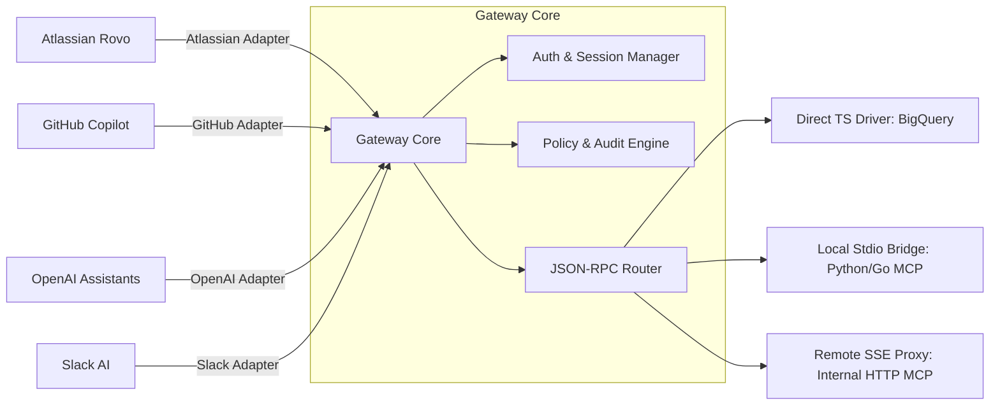

# Roadmap: Enterprise SaaS-to-MCP Adapter Gateway

Roadmap ini memetakan transisi proyek dari spesifik BigQuery & Atlassian MCP Server menjadi sebuah **Enterprise SaaS-to-MCP Adapter Gateway** yang universal, aman, dan modular.

---

## Gambaran Umum Arsitektur Target

---

## Rincian Fase Pengembangan

### Fase 1: Refactoring & Isolasi Arsitektur (Foundations)
Fase ini fokus memisahkan logika Atlassian yang saat ini bercampur di dalam kode utama agar menjadi modul independen serta mempersiapkan fondasi modul bersama.

*   **Pemisahan Inbound Adapter (Atlassian)**:
    *   Memindahkan logika Dynamic Client Registration (DCR) dan token exchange dari [`oauth.ts`](file:///Users/OUT2305/Repo/bigquery-mcp/src/oauth.ts) ke `src/adapters/atlassian/`.
    *   Memastikan [`server.ts`](file:///Users/OUT2305/Repo/bigquery-mcp/src/server.ts) bertindak sebagai HTTP Router bersih yang mendistribusikan request ke adapter masing-masing.
*   **Abstraksi Modul Otentikasi Bersama (Shared Auth Module)**:
    *   Membuat modul inti `src/core/auth/` untuk membungkus logika generik OAuth 2.0/OIDC (verifikasi tanda tangan JWT, penyimpanan kunci JWKS, dan penanganan state PKCE) agar tidak terjadi duplikasi kode saat mengintegrasikan adapter lain (seperti OpenAI atau Slack).
*   **Decoupling Core MCP Router**:
    *   Membuat modul `src/core/mcpRouter.ts` yang murni menangani JSON-RPC request/response MCP tanpa ketergantungan langsung ke Express `Request` / `Response` object.
*   **Generalisasi Konfigurasi**:
    *   Membuat file konfigurasi terpusat (misal `src/config/gateway.config.ts`) untuk mengaktifkan/menonaktifkan adapter tertentu berdasarkan variabel lingkungan (`.env`).

### Fase 2: Pengembangan Outbound Drivers (Downstream Connectivity)
Menyediakan berbagai cara bagi gateway untuk mengeksekusi tool dari berbagai sumber.

*   **Direct TypeScript Driver**: 
    *   Membungkus logic seperti [`bigquery.ts`](file:///Users/OUT2305/Repo/bigquery-mcp/src/bigquery.ts) sebagai modul yang dipanggil secara lokal.
*   **Local Stdio Subprocess Bridge**:
    *   Memungkinkan gateway menjalankan server MCP pihak ketiga (misal: Python/Go) secara lokal sebagai *child process* dan berkomunikasi menggunakan input/output standard.
*   **Remote SSE Proxy Driver**:
    *   Menghubungkan gateway ke MCP server internal lain yang berjalan di jaringan privat menggunakan HTTP/SSE.

### Fase 3: Integrasi Inbound Adapters Baru
Menambahkan pintu masuk bagi platform AI non-Atlassian serta menyediakan antarmuka kustom untuk pihak ketiga.

*   **OpenAI Action Adapter**:
    *   *Translasi Protokol*: Membuat parser yang secara otomatis menerjemahkan tool schema MCP menjadi dokumentasi **OpenAPI (Swagger) JSON**.
    *   *Otentikasi*: Menyediakan endpoint otentikasi standar (OAuth 2.0 atau Static API Key) yang bisa dibaca oleh OpenAI.
*   **GitHub Copilot Extension Adapter**:
    *   *Otentikasi*: Logika untuk memverifikasi tanda tangan JWT dari GitHub App.
    *   *Mapping*: Memetakan format interaksi Copilot Agent ke format panggilan tool MCP.
*   **Slack Agent Adapter**:
    *   *Otentikasi*: Logika untuk memverifikasi header `X-Slack-Signature` dan request token.
*   **Custom Inbound Adapter (Plugin System)**:
    *   *Abstraksi Kontrak*: Mendefinisikan interface/abstract class `BaseInboundAdapter` untuk standarisasi pembuatan adapter baru secara mandiri oleh pengembang eksternal.
    *   *Dynamic Loader*: Membangun mekanisme registrasi dinamis agar gateway dapat mendeteksi, memuat, dan mendaftarkan route HTTP untuk adapter kustom berdasarkan konfigurasi pengguna tanpa mengubah kode inti.

### Fase 4: Enterprise Security, Governance & Audit (Guardrails)
Fitur tingkat enterprise untuk memantau dan mengontrol eksekusi AI agent.

*   **Granular Policy Engine**:
    *   Menerapkan filter kueri yang aman (seperti SQL validator di [`validateQuerySafety`](file:///Users/OUT2305/Repo/bigquery-mcp/src/mcp.ts#L14)) secara dinamis ke semua database driver.
    *   Membatasi hak akses (*scopes*) berdasarkan identitas pengguna asli dari platform SaaS asal.
*   **Centralized Audit Logging**:
    *   Format log JSON yang terstandarisasi untuk dikirim ke Google Cloud Logging, Datadog, atau Elasticsearch.
*   **Rate Limiting & Cost Management**:
    *   Pengaturan batas kuota pemanggilan API atau estimasi billing query per pengguna/platform.

---

## Hal-Hal Penting yang Perlu Diulas (Potensi Luput / Design Challenge)

Selama diskusi kita, ada beberapa detail teknis penting yang membutuhkan keputusan arsitektur khusus:

### 1. Persistence Layer untuk Dynamic Clients (DCR)
*   **Tantangan**: Saat Atlassian melakukan Dynamic Client Registration (DCR), server menghasilkan `client_id` dan `client_secret` secara dinamis.
*   **Isu**: Saat ini, proyek dirancang *stateless* (menggunakan *in-memory storage* sementara). Jika kontainer di-*restart* (misalnya saat *cold start* di Cloud Run), data registrasi klien akan hilang, sehingga memutuskan koneksi Atlassian.
*   **Solusi Terpilih**:
    *   **Abstraksi Database**: Membuat *interface* `ClientRepository` di dalam gateway untuk menyembunyikan detail penyimpanan klien.
    *   **Driver Firestore / AWS DynamoDB**: Menyediakan implementasi *driver* database NoSQL bawaan (seperti Google Cloud Firestore) yang *serverless* dan tidak memerlukan pengelolaan infrastruktur (*no-ops*).
    *   **Driver Redis / PostgreSQL**: Menyediakan opsi *driver* relasional (Postgres) atau memori terdistribusi (Redis) untuk proyek yang sudah memiliki basis data tersebut.

### 2. Sinkronisasi Identitas Pengguna (User Identity Propagation / UIP)
*   **Tantangan**: AI Agent memanggil API atas nama pengguna akhir (misalnya pengguna "Iqbal" di Slack atau Jira).
*   **Isu**: Menghindari eksekusi kueri menggunakan token akses dengan izin penuh (*system-wide / god-mode*) untuk menghindari kebocoran data sensitif.
*   **Solusi Terpilih**:
    *   **Ekstraksi Klaim Email**: Mengekstrak klaim identitas (`email`) dari JWT token akses OAuth 2.1 yang didelegasikan oleh platform klien.
    *   **Query Impersonation**: Meneruskan identitas tersebut ke tingkat *data source* (misalnya menggunakan fitur *Impersonation* di BigQuery atau *Row-Level Security* di PostgreSQL) agar kueri dijalankan sesuai batasan akses pengguna tersebut.
    *   **Tabel Otorisasi Internal**: Menyediakan tabel pemetaan pengguna (`UserMapping`) untuk menetapkan pembatasan kueri/data tertentu berdasarkan domain email atau grup otorisasi pengguna.

### 3. Latency dari Downstream Bridging
*   **Tantangan**: Jalur kueri (SaaS Platform -> Gateway -> Downstream MCP -> Database) menambah latensi jaringan yang rentan memicu *timeout* (biasanya batas waktu di Slack/OpenAI adalah 3 detik).
*   **Isu**: Eksekusi kueri analitik berat pada BigQuery atau *cold start* server downstream bisa dengan mudah melebihi batas waktu tersebut.
*   **Solusi Terpilih**:
    *   **Koneksi Persistent & Connection Pooling**: Menggunakan HTTP Keep-Alive dan *connection pooling* untuk mengurangi latensi jabat tangan (*handshake*) TCP/TLS.
    *   **Pola Eksekusi Asinkron & Webhook**: Untuk kueri berat, gateway akan merespon cepat dengan status `202 Accepted` beserta ID pekerjaan (*job ID*). Setelah kueri selesai diproses di latar belakang, gateway mengirimkan hasilnya ke platform SaaS melalui *Webhook Callback URL*.
    *   **Kaching & Dry-run Proyektif**: Menyimpan hasil kueri yang sering dipanggil ke dalam cache terdistribusi (Redis) dengan TTL singkat.
